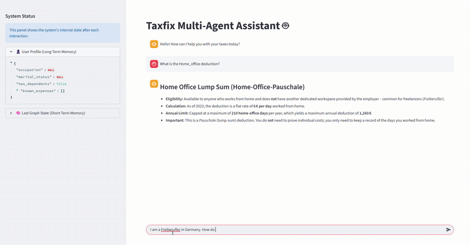
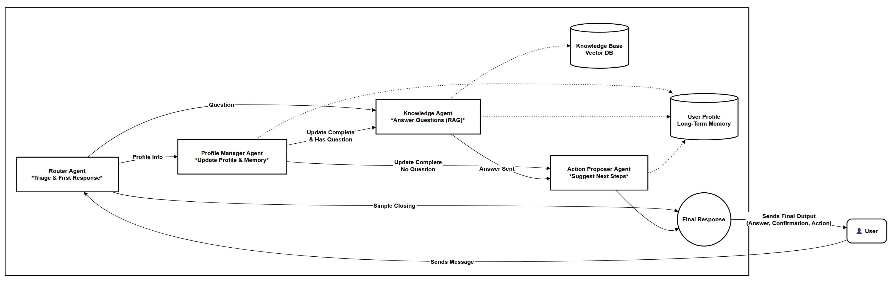

    
# Taxfix Multi-Agent System Prototype

This repository contains a prototype for a multi-agent system designed for personalized tax declarations, as part of the Taxfix case study. The system uses natural conversation to understand a user's context, learn their situation over time, and offer personalized, actionable guidance.

---

## 🚀 Live Demo

*(Optional but highly recommended: Record a short GIF of you interacting with the app and embed it here. It's a great way to make an immediate impression.)*



---

## ✨ Key Features

This prototype successfully demonstrates the core capabilities outlined in the case study:

*   **Memory Integration:** The system manages both short-term conversational context and a persistent long-term user profile. Information learned (e.g., occupation, marital status) is used to guide future interactions.
*   **Personalised Guidance:** Utilizes a RAG (Retrieval-Augmented Generation) pipeline with a simulated tax knowledge base to provide tailored explanations and identify relevant deductions based on the user's profile.
*   **Action-Oriented Interaction:** Proactively suggests next steps to the user (e.g., "Would you like to add an expense?") and presents interactive buttons to maintain an engaging experience.
*   **Transparent Reasoning:** The Streamlit UI sidebar and terminal logs provide a clear view into the agent's "thoughts," showing which agent is running and how the user's profile impacts the conversation.

---


## 💬 Conversation Demonstration

The following is a complete, unedited conversation with the prototype, showcasing all the key features in a single, continuous flow.

<details>
<summary><strong>Click to expand the full conversation log</strong></summary>

**👤 User Profile (Initial State):**
```json
{
  "occupation": null,
  "marital_status": null,
  "has_dependents": false,
  "known_expenses": []
}

  

🤖 AI: Hello! How can I help you with your taxes today?

🙂 Human: What is the Home-Office-Pauschale?

🤖 AI:
Home Office Lump Sum (Home-Office-Pauschale)

    Eligibility: Available to anyone who works from home, including freelancers (Freiberufler), and does not have another dedicated workspace provided by their employer.

    Calculation: A lump sum of 6 € per day worked from home.

    Annual Limit: Capped at a maximum of 210 home-office days per year, resulting in a maximum annual deduction of 1,260 €.

🙂 Human: I'm a Freiberufler in Germany. How do I file my taxes?

🤖 AI:
Filing Taxes as a Freiberufler (Self-Employed)

    Register with the Finanzamt: Obtain a Steuernummer (business tax number) from your local tax office.

    Use the ELSTER portal: ELSTER is the mandatory online platform for all tax filings.

    Quarterly estimated tax payments: As a freelancer you must pay income tax in advance.

    Annual income-tax return: File the Einkommensteuererklärung via ELSTER, including revenue and business expenses.

(The AI now displays an interactive prompt because it has learned the user is a freelancer with no logged expenses)

🤖 AI: Of course. What are the expenses you would like to add? Please list them (e.g., 'Office supplies 50 €, business travel 300 €').

🙂 Human: I bought a new office chair for 250 euros and a train ticket for a client meeting for 85 euros.

🤖 AI: Got it. I've updated your profile with: occupation, known_expenses.

👤 User Profile (Updated State):
code JSON

    
{
  "occupation": "freelancer",
  ...
  "known_expenses": [
    "Office chair purchase",
    "Train ticket"
  ]
}

  

🙂 Human: What about work equipment (arbeitsmittel)?

🤖 AI:
Work Equipment (Arbeitsmittel)

    Definition: Work equipment is any item necessary for your freelance activity.

    Deduction: Such items can be claimed as business expenses. Keep the invoice (e.g., for the 250 € office chair).

🙂 Human: Is there a cost limit for immediate deduction?

🤖 AI: (Demonstrating honesty about knowledge gaps)
The provided documents state that items like the 250 € office chair can be claimed as a business expense. However, if you need the precise legal threshold for low-value assets, you would have to consult the current tax code, as that detail is not covered in the supplied context.
</details>

## 🏛️ System Architecture

The system is built using a stateful graph architecture orchestrated by **LangGraph**. This allows for complex, cyclical conversational flows where agents can hand off tasks to one another.




    
### Component Roles

*   **Router Agent:** The entry point. It analyzes the user's latest message to determine intent and routes the conversation to the appropriate agent (e.g., `profile_manager` if new info is present, `knowledge_agent` for a question).
*   **Profile Manager Agent:** The memory gatekeeper. It extracts structured information (occupation, expenses, marital status) from the conversation and updates the long-term user profile. It then decides if a follow-up action is needed.
*   **Knowledge Agent:** The RAG-powered expert. It answers specific tax questions by retrieving relevant information from our simulated knowledge base, ensuring answers are grounded and accurate. It is responsible for formatting the output for readability.
*   **Action Proposer Agent:** The proactive assistant. After a question is answered, it analyzes the user's profile to see if it can suggest a helpful next step, like adding an expense.

### Memory Management

The system uses a dual-memory approach:
*   **Short-Term Memory:** The turn-by-turn conversation history is managed within the `GraphState` object and passed to every agent, providing immediate context.
*   **Long-Term Memory:** A structured `UserProfile` dictionary (persisted in Streamlit's session state for this prototype) holds key facts about the user. This profile is loaded at the start of each turn and updated by the `Profile Manager`.

---

## 🔧 Setup & How to Run

1.  **Clone the repository:**
    ```bash
    git clone https://github.com/anky3733/Tax_Multi_Agent.git
    cd taxfix-multi-agent
    ```
2.  **Set up the environment:**
    ```bash
    conda create --name taxfix_agent python=3.10 -y
    conda activate taxfix_agent
    ```
3.  **Install dependencies:**
    ```bash
    pip install -r requirements.txt
    ```
4.  **Set up API Keys:**
    *   Create a file named `.env` in the root directory.
    *   Add your Groq API key: `GROQ_API_KEY="your_key_here"`
5.  **Run the Streamlit App:**
    ```bash
    streamlit run app.py
    ```
---

## 🧠 Reflection & Future Improvements

### Challenges Encountered

Building this prototype revealed several key challenges in creating personalized multi-agent systems:

*   **Model Adherence & API Validation:** A significant challenge was ensuring the LLM's output strictly matched the required schema for tool calls (e.g., outputting a native boolean `true` vs. a string `"true"`). This required highly explicit, data-type-aware prompt engineering.
*   **Intent Disambiguation:** The initial router struggled to differentiate between a user message containing both new information and a question. I solved this using few-shot prompting to teach the router to prioritize updating the user's profile first.
*   **State Management & Recursion:** An early version of the graph created an infinite loop where the system would react to its own "thought" messages. This was solved by creating a more intelligent, linear hand-off from the `Profile Manager` to the `Knowledge Agent` instead of looping back to the router.
*   **Output Formatting & Readability:** The raw output from the LLM was often unappealing (e.g., "walls of text," garbled spacing). I implemented a dedicated text-cleaning function and enhanced the `Knowledge Agent`'s prompt with Markdown formatting rules to dramatically improve the user experience.

### Potential Future Improvements

*   **Persistent User Profiles:** Move from Streamlit's session state to a proper database (like SQLite or a NoSQL DB) to persist user profiles between sessions.
*   **More Sophisticated Tools:** Equip agents with more powerful tools, such as a `CalculatorTool` for real-time tax calculations or a `DocumentReaderTool` to allow users to upload and ask questions about their tax forms.
*   **Human-in-the-Loop Escalation:** Implement a pathway for the system to flag conversations where it has low confidence and escalate them to a human tax expert.
*   **Expanded Knowledge Base:** Continuously update the vector database with more comprehensive and up-to-date tax laws and regulations to broaden the agent's expertise.

  
