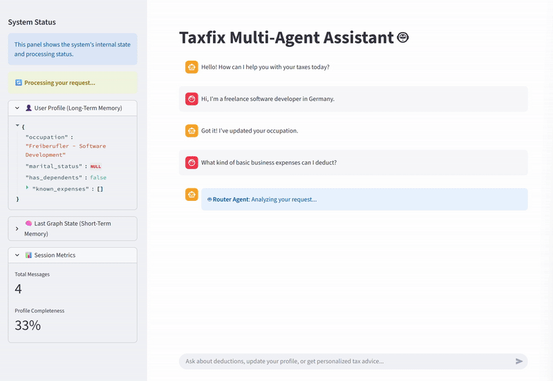

# Taxfix Multi-Agent System Prototype

This repository contains a prototype for a multi-agent system designed for personalized tax declarations, developed for the Taxfix case study. The system uses natural conversation to understand a user's context, build a persistent profile over time, and offer personalized, actionable guidance through a stateful, conditional graph of AI agents.

---

## 🚀 Live Demo



*A screen recording of the final working application showing streaming responses, sidebar updates, and interactive action buttons.*

---

## ✨ Key System Capabilities

This prototype successfully implements the three core capabilities required by the case study, demonstrating a cohesive and intelligent user experience.

### 🧠 Memory Integration

The system effectively manages both short-term and long-term memory:

- **Short-Term (Conversation Context):** The `GraphState` object carries the turn-by-turn message history, ensuring agents have immediate context. This is visible when the `RouterAgent` correctly interprets a follow-up question.
- **Long-Term (Persistent User Profile):** A `UserProfile` dictionary is built incrementally throughout the conversation. The **Profile Manager Agent** extracts and adds information (e.g., occupation, income, marital status), which is then used by all other agents to personalize their responses.

### 🎯 Personalised Guidance

The assistant provides tailored, relevant advice instead of generic information:

- **Tailored Explanations:** The **Knowledge Agent** uses a RAG pipeline augmented with the user's profile. It enhances search queries with profile data (e.g., adding "freelancer" or "married" in German) to retrieve and generate more relevant answers.
- **Relevant Deductions:** The **Action Proposer Agent** analyzes the completed user profile to identify high-value, personalized opportunities. For example, it will only suggest optimizing tax classes *after* learning the user is married.

### 💡 Action-Oriented Interaction

The system proactively guides the user and encourages interaction:

- **Suggest Specific Actions:** After answering a question, the **Action Proposer Agent** suggests a logical next step (e.g., "Add Income Info," "Check Tax Class").
- **User Confirmation & Engagement:** The Streamlit UI renders these suggestions as interactive buttons, allowing the user to accept or decline the proposed action, creating a smooth and engaging conversational flow.

---

## 💬 Live Conversation Transcript

The following is a complete, unedited transcript from an interaction with the final prototype. It showcases all key capabilities working in harmony: memory building, personalized RAG, and proactive, contextual action proposals.

<details>
<summary><strong>Click to expand the full conversation log</strong></summary>

**Initial `UserProfile` State:**
```json
{
  "occupation": null,
  "marital_status": null,
  "has_dependents": false,
  "known_expenses": [],
  "annual_income": null,
  "income_range": null
}
```

---

**🤖 AI:** Hello! How can I help you with your taxes today?

**🙂 Human:** Hi, I'm a freelance software developer in Germany.

**🤖 AI:** Got it! I've updated your occupation.

**UserProfile after update:**
```json
{
  "occupation": "Freiberufler - Software Development",
  "marital_status": null,
  "has_dependents": false,
  "known_expenses": []
}
```

---

**🙂 Human:** What kind of basic business expenses can I deduct?

**🤖 AI:**

**Quick Answer:** As a freelance software developer in Germany, you can deduct basic business expenses such as home office costs, internet and telephone expenses, vehicle expenses, and work equipment, provided you can document their business use.

**Key Details:**

- **Home Office:** You can claim a lump sum per day worked from home if you don't have a dedicated workspace elsewhere.
- **Work Equipment (Arbeitsmittel):** Items like laptops, software, and office furniture are deductible. There are special rules for immediate deduction of computer equipment.
- **Vehicle Expenses (Fahrtkosten):** You can deduct costs for business-related travel, like client visits, using either a flat rate per kilometer or the actual expense method.

*(The KnowledgeAgent provides a grounded answer. Now, the ActionProposerAgent runs and sees the profile is missing income.)*

**💡 AI (Suggested Action):** As a freelance software developer, providing your income details is essential for tax planning and to determine the potential tax savings from business expenses.

- [💰 Add Income Info] [❌ Not now]

*(User clicks the "Add Income Info" button)*

**🤖 AI:** Great! Please tell me about your income. For example: 'I earn 3500€ per month' or 'My annual income is about 50000€'

**🙂 Human:** My annual revenue is around €70,000.

**🤖 AI:** Got it! I've updated your income details.

**UserProfile after update:**
```json
{
  "occupation": "Freiberufler - Software Development",
  "marital_status": null,
  "has_dependents": false,
  "known_expenses": [],
  "annual_income": 70000,
  "monthly_income": 5833,
  "income_range": "60k-100k"
}
```

---

**🙂 Human:** I bought a new work laptop for €1,500. Can I deduct the full cost immediately?

**🤖 AI:** Got it! I've recorded your expenses.

**Quick Answer:** Yes, as a freelance software developer, you can deduct the full €1,500 cost of your work laptop immediately.

**Key Details:**

- A special rule for computer hardware and software allows for 100% depreciation in the year of purchase, regardless of the cost.
- This is an exception to the general rule for low-value assets (which has an €800 limit).
- You must keep the purchase receipt or invoice as proof for the tax office.

*(The ProfileManager first recorded the expense, then the KnowledgeAgent answered the question. Now the ActionProposer runs and sees the next logical gap.)*

**💡 AI (Suggested Action):** As a freelance software developer earning €70,000 per year, recording more business expenses can significantly reduce your taxable profit.

- [📝 Add Expenses] [❌ Not now]

---

**🙂 Human:** I'm married and my wife doesn't work. We have one child.

**🤖 AI:** Got it! I've updated your marital status and noted you are with dependents.

**UserProfile after update:**
```json
{
  "occupation": "Freiberufler - Software Development",
  "marital_status": "married",
  "has_dependents": true,
  "spouse_annual_income": 0.0,
  "annual_income": 70000,
  "monthly_income": 5833
}
```

---

**🙂 Human:** What's the best tax class for us then?

**🤖 AI:**

**Quick Answer:** For your situation, Tax Class III (3) for you and Tax Class V (5) for your wife is almost always the most beneficial combination.

**Key Details:**

- This combination is designed for married couples where one partner earns significantly more than the other (or has no income).
- As the higher earner in Tax Class III, you receive both your and your wife's basic tax-free allowance, which greatly reduces your monthly tax withholding.
- This results in the highest possible net income for your household each month.

*(The KnowledgeAgent gives a personalized answer. The ActionProposer runs again and identifies the final, most important gap.)*

**💡 AI (Suggested Action):** As a married freelancer with a non-earning spouse, adjusting your tax class (e.g., to III/V) can significantly lower the amount of tax withheld and increase your net income.

- [📊 Check Tax Class] [❌ Not now]

</details>

---

## 🏛️ System Architecture

The system is built as a stateful, conditional graph using **LangGraph**. This architecture moves beyond simple agent chains, allowing for intelligent, cyclical, and multi-step reasoning. The graph's state (`GraphState`) is passed between nodes, and each agent's output determines which node runs next.


### Component Roles

#### 1. Router Agent
The system's entry point. It performs rapid analysis of the user's message to determine intent (e.g., asking a question vs. providing information) and makes the initial routing decision. Designed to be fast and deterministic for reliability.

#### 2. Profile Manager Agent
The "memory" and "internal router" of the system. It uses an LLM to extract structured data from conversations and updates the user's long-term profile. After updating, it makes a secondary routing decision: end the turn with a confirmation or pass control to another agent (like the KnowledgeAgent) if a question was also asked.

#### 3. Knowledge Agent
The RAG-powered tax expert. It answers user questions by first retrieving relevant documents from a vector database and then synthesizing an answer that is grounded in facts and personalized with the user's profile context.

#### 4. Action Proposer Agent
The proactive advisor. It runs after a primary task is completed, analyzes the user's profile for gaps or optimization opportunities, and suggests a single, high-value next action. It includes cooldown logic to avoid making repetitive suggestions.

### Memory Management

The system uses a dual-memory approach to meet the case study's requirements:

- **Short-Term Memory:** The turn-by-turn conversation history is stored in the `GraphState` object. This state is passed between all agents in the graph, providing immediate context for their decisions.
- **Long-Term Memory:** A structured `UserProfile` dictionary holds key facts about the user. For this prototype, it is persisted in Streamlit's `session_state`. This profile is read at the start of each graph run and updated by the Profile Manager Agent, demonstrating a persistent, evolving understanding of the user.

### Assumptions

- **Tax Knowledge:** The system's tax knowledge is strictly limited to the content of the markdown files in the `/data` directory. It is instructed to state when it cannot answer a question from the provided context.
- **Models:** The system is optimized for fast, high-quality models available via the Groq API (e.g., Llama3-70b, Llama3-8b), but can be adapted to other providers.
- **Data Persistence:** The user profile is stored in-memory for the duration of the browser session. A production system would use a database.

---

## 💡 How Interface Elements are Demonstrated

The Streamlit prototype is designed to make the agent's internal workings transparent:

### Streaming Responses
The typewriter effect used for the AI's final answer demonstrates how responses can be generated and displayed token by token.

### Transparent Reasoning

- The **sidebar** provides a live JSON view of the `UserProfile` (long-term memory) and the `last_graph_state` (short-term memory), showing exactly what the system knows and how it decided on its last action.
- The rationale provided with each **Suggested Action** explicitly states the agent's reasoning in natural language.

### Memory's Impact
A user can watch the `UserProfile` in the sidebar update after they provide new information. They can then see the direct impact of this new memory when the next Suggested Action is more personalized and relevant to their updated situation.

### Adaptive & Contextual Interaction
The system's suggestions change as the profile is filled. It first asks for income, then expenses, and finally tax class—a logical, adaptive progression.

### Actionable Suggestions
Interactive buttons in the chat interface directly implement the concept of actionable suggestions, allowing the user to guide the conversation.

---

## 🔧 Setup & How to Run

### 1. Clone the Repository

```bash
git clone https://github.com/anky3733/Tax_Multi_Agent.git
cd <your-repo-directory>
```

### 2. Set Up a Conda Environment

```bash
conda create --name taxfix_agent python=3.10 -y
conda activate taxfix_agent
```

### 3. Install Dependencies

```bash
pip install -r requirements.txt
```

### 4. Set Up API Keys

Create a file named `.env` in the project's root directory and add your Groq API key:

```
GROQ_API_KEY="gsk_YourSecretKeyHere"
```

### 5. Run the Streamlit App

```bash
streamlit run app.py
```

The application will open in your web browser.

---

## 🧠 Reflection & Future Improvements

### Challenges Encountered

This project highlighted several core challenges in building robust, stateful multi-agent systems:

#### Orchestration Logic (Waterfall vs. Graph)
My initial design was a simple, sequential chain where agents ran one after another. This led to chaotic and repetitive behavior (e.g., the ActionProposer running at the wrong time). The most critical improvement was re-architecting the system into a conditional graph with LangGraph. This allowed agents to make routing decisions and end the turn appropriately, which was the key to creating a coherent conversation.

#### State Synchronization Between Agents
A subtle but significant bug was the "ghost income" problem, where the ActionProposer would ask for income even after the ProfileManager had just saved it. This was caused by an incomplete state update (missing the `income_range` field). The solution was to make the ProfileManager responsible for deriving and saving all related state fields, ensuring all agents operate on a consistent and complete view of the world.

#### LLM Reliability and Prompt Engineering
Getting the LLMs to reliably extract information and make decisions was a process of iterative prompt engineering. For instance, the ProfileManager initially failed to infer `marital_status: "married"` from the phrase "my wife." I had to explicitly add a "Logical Inferences" section to its prompt to give it permission to make these common-sense connections without hallucating.

### Potential Future Improvements

#### Persistent User Profiles
Replace the `session_state` with a database (e.g., SQLite, PostgreSQL) to allow user profiles to persist across browser sessions, creating a true long-term memory.

#### Expand Agent Tools

- Give the KnowledgeAgent a `CalculatorTool` to perform real-time tax estimations based on the user's profile.
- Create a `DocumentReaderTool` that allows users to upload their Lohnsteuerbescheinigung (annual tax statement) for automated data extraction.

#### Human-in-the-Loop Escalation
Implement a mechanism where an agent can flag a conversation for human review if it encounters a question it cannot answer or detects high user frustration.

#### Testing and Validation Suite
Develop a suite of unit and integration tests to validate agent behavior and prevent regressions as new features or knowledge sources are added.

---

## 📝 License

This project is licensed under the MIT License - see the LICENSE file for details.

## 🙏 Acknowledgments

Built as part of the Taxfix case study assignment, demonstrating multi-agent AI systems for personalized tax assistance.
